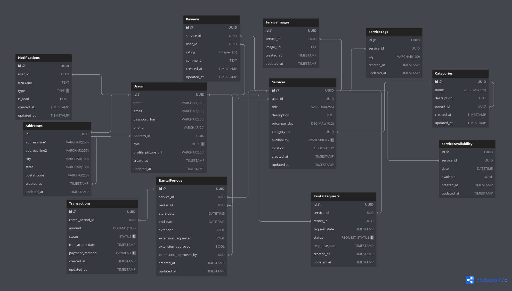

# FarmHub

Welcome to **FarmHub**! FarmHub is an advanced platform designed to connect farmers and agriculture-related service providers. Our application allows users to offer and rent services, including farming materials and trackers, to help with agricultural needs. We also support individuals or companies looking to start agriculture-related businesses, providing resources and assistance for new ventures.

## Tech Stack

- **Next.js**: A React framework for building server-side rendered and statically generated web applications.
- **Drizzle**: An ORM for managing and interacting with your database.
- **Shadcn**: A library for building accessible and customizable components.
- **Supabase**: A powerful backend-as-a-service (BaaS) platform that provides authentication, real-time databases, and more.

## Features

- **User Authentication**: Secure user login and registration using Supabase.
- **Service Listing**: Users can list farming services and materials for rent.
- **Service Management**: Providers can manage their listings and extend rental periods.
- **Responsive Design**: Built with a responsive layout to ensure a seamless experience on all devices.

## Getting Started

### Prerequisites

- Node.js (>= 16.x)
- Yarn (or npm)
- Docker (optional but recommended for setting up the development environment)

### Installation

1. **Clone the repository:**

   ```bash
   git clone https://github.com/your-username/farmhub.git
   cd farmhub
   ```

2. **Install dependencies:**

   ```bash
   yarn install
   ```

   Or with npm:

   ```bash
   npm install
   ```

3. **Set up environment variables:**

   Create a `.env.local` file in the root directory and add your environment variables. For Supabase, include your credentials:

   ```env
   NEXT_PUBLIC_SUPABASE_URL=your-supabase-url
   NEXT_PUBLIC_SUPABASE_ANON_KEY=your-supabase-anon-key
   ```

4. **Run the development server:**

   ```bash
   yarn dev
   ```

   Or with npm:

   ```bash
   npm run dev
   ```

   Open [http://localhost:3000](http://localhost:3000) in your browser.

### Database Setup

Ensure your Drizzle configuration is set up to connect with your database. You can find the configuration in the `drizzle.config.ts` file.

### Database desine

link -https://dbdiagram.io/d/farmHub-database-desine-66ac599b8b4bb5230e058d6a


### Deployment

Deploy your application to Vercel or another hosting provider. For Vercel:

1. **Push your code to GitHub:**

   ```bash
   git add .
   git commit -m "Initial commit"
   git push origin main
   ```

2. **Connect your GitHub repository to Vercel and follow the prompts to deploy your application.**

## Contributing

We welcome contributions to FarmHub! To get started:

1. **Fork the repository.**
2. **Create a new branch for your feature or bug fix.**
3. **Make your changes and test them.**
4. **Submit a pull request with a description of your changes.**

## License

This project is licensed under the MIT License. See the [LICENSE](LICENSE) file for more details.

## Contact

For any questions or issues, please contact us at [support@farmhub.com](mailto:support@farmhub.com).

---

Thank you for using FarmHub! We hope it helps you manage and grow your agricultural ventures effectively.

```

Feel free to customize it further to match your specific needs and details.
```
